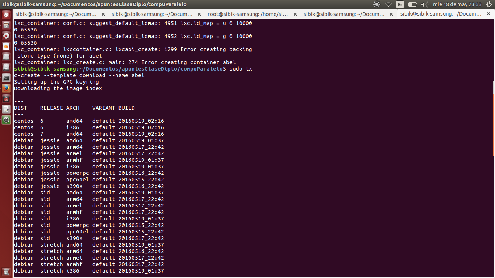
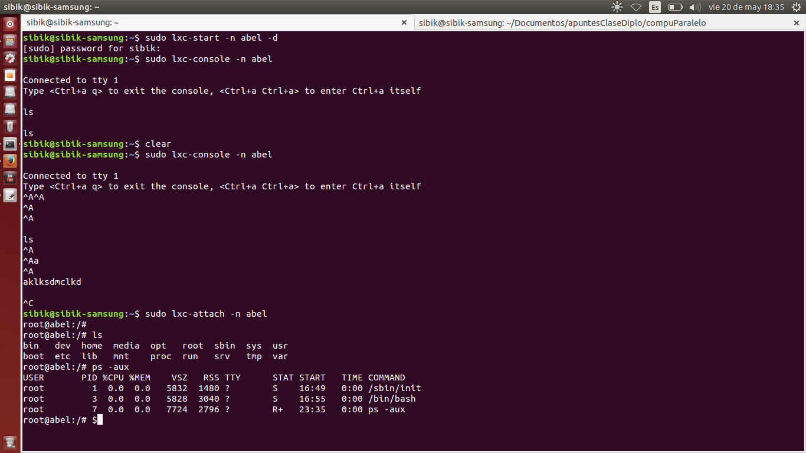
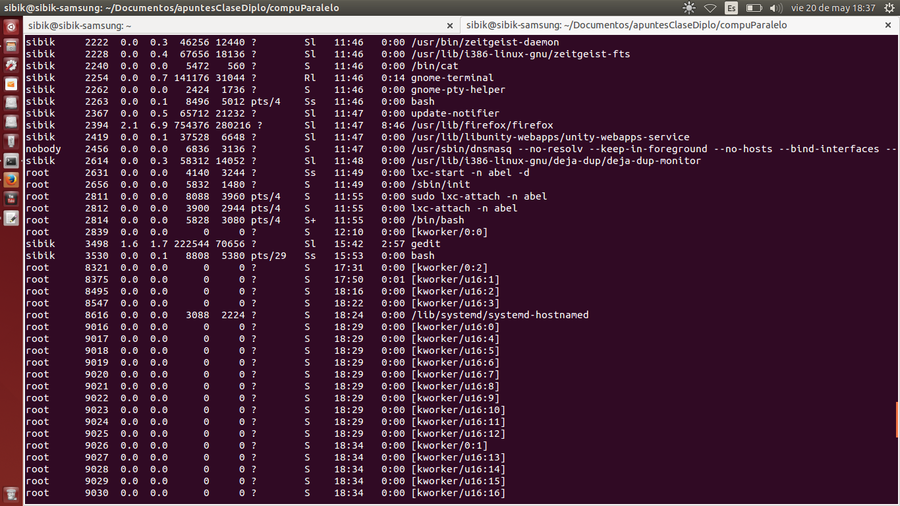

# LinuX Containers
=====

La tecnología de LinuX Containers  permite crear contenedores algo similar a servidores linux completamente aislados, los cuales comparten el kernel con el equipo. Es como una virtualización muy ligera y por lo tanto no tiene un impacto negativo en el rendimiento.

En Linux Ubuntu, ya vien por dafault. Así que crearemos un contenedor.

Crearemos un contenedor de nombre "abel" usando la plantilla "ubuntu"y la arquitectura "i386". Podemos listar todas las opciones con: "-- --help".

`sudo lxc-create -t ubuntu -n abel`

Iniciamos el contenedor en background.

`sudo lxc-start -n abel -d`

Entramos a la consola del contenedor con ctrl-a y + q para salir.

`sudo lxc-console -n abel`

Entrar directamente en el Bash del contenedor (sin loguearse en la consola), requiere  kernel >= 3.8 

`sudo lxc-attach -n abel`

Entrar a SSH

`sudo lxc-info -n abel`

ssh ubuntu@<ip from lxc-info>

Para detener el contenedor existen varias alternativas
- Detenerlo desde dentro

`sudo poweroff`

- Detenelo desde afuera

`sudo lxc-stop -n abel`

- Matarlo desde afuera

`sudo lxc-stop -n abel -k`

Desde la terminal del contenedor ejecutamos:

`ps -aux` 

Desde la terminal del equipo host ejecutamos:

`ps -aux`

https://github.com/sibik/linuxContainers.git

[Github](https://github.com/sibik/linuxContainers.git)

